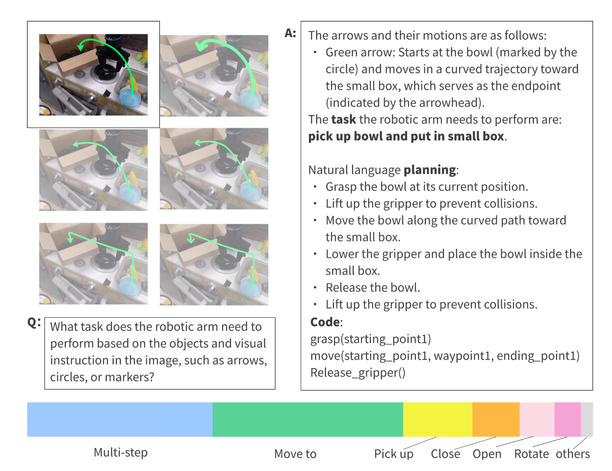
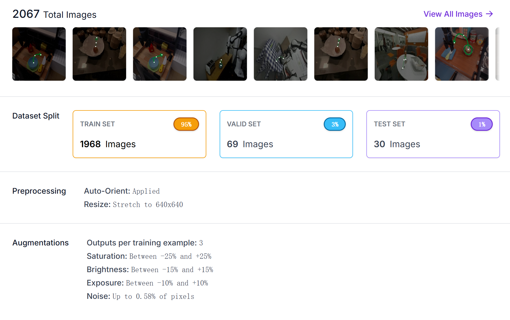

# RoVI-Book Dataset

<div align="center">
  <h3>🎉 <strong>CVPR 2025</strong> 🎉</h3>
  <p>Official dataset for <a href="https://robotic-visual-instruction.github.io/">Robotic Visual Instruction</a></p>
</div>



This is an example to demonstrate the RoVI Book dataset, adapted from the Open-X Embodiments dataset. The bottom displays the proportion of each task type.

## Introduction
RoVI-Book is a dataset focused on robotic manipulation and visual understanding for robotic visual instruction. The dataset contains a large collection of sequential images capturing robot operations, covering both single-step and multi-step manipulation scenarios.

## Dataset Structure

```
dataset/
├── dataset_llava.json          # Dataset file in LLaVA format
└── obs/                        # Observation data
    ├── pics_multi_step/        # Multi-step operation images
    │   ├── circle/            # Images with circle annotations
    │   └── no_circle/         # Images without annotations
    ├── pics_one_step/         # Single-step operation images
    │   ├── circle/           # Images with circle annotations
    │   └── no_circle/        # Images without annotations
    └── rotation/              # Rotation-related images
        ├── multi_step/       # Multi-step rotation operations
        └── one_step/         # Single-step rotation operations

```


## Image Categories
1. Multi-step Operation Images: Recording complete operation sequences
2. Single-step Operation Images: Capturing individual actions
3. Rotation Operation Images: Focusing on object flipping and rotation actions

## Annotation Information
- circle/: Contains images with circle annotations 
- no_circle/: Contains images without circle annotations

## Training

This dataset is designed for training vision-language models for rovi task following. The training process follows the methodology established by [LLaVA](https://github.com/haotian-liu/LLaVA) for visual instruction tuning.


### Data Format

The dataset follows the LLaVA format with the following structure in `dataset_llava.json`:

```json
{
  "id": "unique_id",
  "image": "path/to/image.jpg", // contains rovi's visual instruction
  "conversations": [
        {
      "from": "human",
      "value": "Instruction or question about the robotic task" // default prompt for system
    },
    {
      "from": "gpt", 
      "value": "Expected response or action description" // contains planning and function code
    }
  ]
}
```


### Getting Started

1. Install the LLaVA framework following the [official guide](https://github.com/haotian-liu/LLaVA)
2. Prepare the RoVI-Book dataset in the required format
3. Use a pre-trained vision-language model (e.g., LLaVA-7B or LLaVA-13B)
4. Fine-tune on the RoVI instruction data

For detailed training scripts and configurations, please refer to the [LLaVA repository](https://github.com/haotian-liu/LLaVA). 

## Keypoint Dataset



This dataset also provides keypoint annotations for training keypoint detection modules using YOLOv8. The keypoint dataset is specifically designed for rovi task extracting keypoints of the arrow or circle. These point structures contain key information during the manipulation process. For detailed training instructions of the keypoint module, please refer to [YOLOv8 documentation](https://docs.ultralytics.com/zh/models/yolov8/#how-do-i-train-a-yolov8-model).

### Dataset Access

The keypoint dataset is available on Hugging Face: [yanbang/rovibook](https://huggingface.co/datasets/yanbang/rovibook/tree/main)